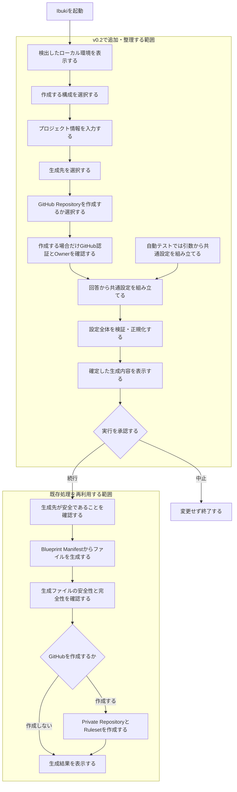

# v0.2 対話ウィザードフロー

Issue: [#12](https://github.com/rukaruka966/ibuki-bootstrapper/issues/12)

## 目的

利用者が一連の質問に答えるだけで生成条件が揃い、そのままプロジェクトファイルの
安全な生成まで完了するようにする。

setup設定ファイルは作成せず、回答内容は実行中のメモリ上だけに保持する。
自動テストでは、既存のコマンドライン引数から同じ共通設定を組み立てる。

## 全体フロー

## この図で追加する責務

- 必要な情報を一連の質問で過不足なく収集する。
- 対話入力と自動テスト用の引数を同じ共通設定へ変換する。
- 実行前に、最終的に採用された設定を利用者へ表示する。
- 承認より前に中止した場合は、ファイルやGitHubを変更しない。
- 回答内容を設定ファイルとして永続化しない。

## 維持する既存の安全性

- 生成先に既存ファイルがある場合は上書きしない。
- ローカル生成と生成ファイルの確認が成功するまでGitHubを変更しない。
- GitHub上にはPrivate Repositoryを作成する。
- `main`と`develop`のRulesetを生成後に検証する。

## 決定事項

- setup設定ファイルは作成しない。
- 対話ウィザードを標準の利用方法とする。
- 回答内容は実行中だけ保持し、生成後には残さない。
- 生成されたコードと設定ファイルをプロジェクトの正しい状態とする。
- 非対話実行は自動テストのために維持する。
- 生成する`AGENTS.md`と`DESIGN.md`は英語版を正本とし、日本語参考版を
  `docs/ja-JP/`へ配置する。

## 実装仕様

質問は次の順序で行う。

1. 構成
2. Project IDと表示名
3. 生成先
4. GitHub Repositoryを作成するか

構成選択には以下を表示する。

- Web: React + Hono（利用可能、Blueprint IDは`web-hono`）
- Web: React + Hono + Spring Boot（Coming soon）
- Web API: Spring Boot（Coming soon）
- Android: Jetpack Compose（Coming soon）
- Windows Desktop: Compose Multiplatform（Coming soon）
- キャンセル

Coming soonまたは不正な値を選んだ場合、ファイルを生成せず構成選択へ戻る。
`0`または`q`を選んだ場合は、ファイルやGitHubを変更せず終了する。
GitHub CLIの認証確認は、GitHub Repositoryを作成すると回答した後に行う。

確認画面には、Blueprint ID、Project ID、表示名、絶対パスへ正規化した生成先、
GitHub Repository、ブランチ、生成プロジェクトの環境要件と推奨コマンドを表示する。
環境要件の確認や推奨コマンドの実行はIbukiの責任外であることも明示する。承認前には
ファイルもGitHub上のリソースも作成しない。
