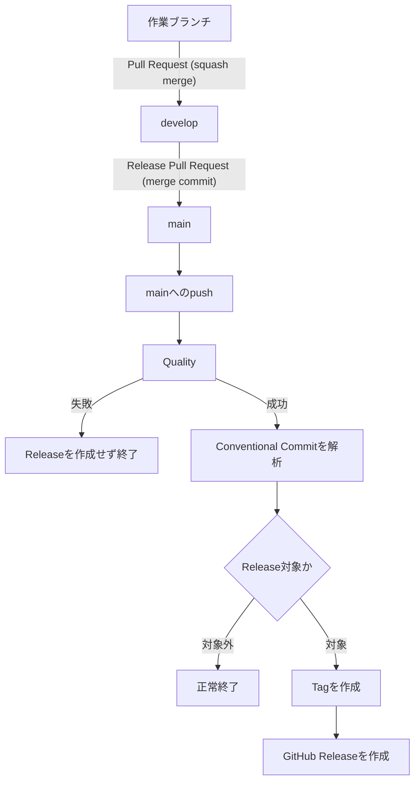

# v0.3 リリース自動化

Issue: [#22](https://github.com/rukaruka966/ibuki-bootstrapper/issues/22)

## 目的

`main`へ反映された変更からバージョン、Git Tag、GitHub Releaseを自動的に
作成する。リリース処理からソースCommitは作らない。

## リリースフロー



リリース経路は`develop`から`main`へのPull Requestだけとし、merge commitで
取り込む。自動Releaseの発火条件は`main`へのpushとする。`main`へ直接入れる
緊急経路は設けない。

`main`と`develop`のRulesetは`Quality`を必須とする。`Quality`では`main`向け
Pull Requestが同一Repositoryの`develop`から来たことも検証する。ただしPull
RequestはWorkflow自体を変更できるため、この検証は個人開発での誤操作防止であり、
悪意ある変更に対するsecurity boundaryではない。

`main`のrequired status checkはstrictを無効にする。release merge commitのたびに
`main`を`develop`へ逆同期しなくても、次のrelease Pull Requestを進められるためで
ある。`develop`ではstrictを有効にし、機能Pull Requestを常に最新の`develop`を
基準として検証する。

## バージョン規則

semantic-releaseとConventional Commitsを使用する。

| Commit | Release |
| --- | --- |
| `fix:` | Patch |
| `feat:` | Minor |
| `perf:` | Patch |
| `BREAKING CHANGE:` | Major |
| `docs:`、`test:`、`chore:`、`ci:` | なし |

正式版までは`BREAKING CHANGE:`を使用せず、互換性のない変更もMinorとして
扱う。最初のMajor Releaseを`v1.0.0`とする。

## v0.2.0基準Tag

自動Releaseの導入前に、v0.2時点の`main`へlightweight Tag `v0.2.0`を付ける。
GitHub Releaseは作成しない。このTagはsemantic-releaseがv0.3の`feat:`を
`v0.3.0`と判定するための計算基準である。

## Releaseの内容

- npm packageは公開しない。
- semantic-releaseはTagとGitHub Releaseだけを作成する。
- Release NotesはConventional Commitから自動生成する。
- Issue・Pull Requestへの自動コメントとラベル追加は行わない。
- `CHANGELOG.md`を自動更新するCommitは作らない。

Repositoryの`CHANGELOG.md`は、正本であるGitHub Releasesへの案内板とする。
merge commitでは`develop`が親Commitになるため、Release後に同期用Pull Requestを
追加する必要はない。semantic-releaseはmerge commit自体を無視し、その履歴に含まれる
Conventional Commitを解析する。

## 起動時のRelease情報

公開された`main`を`irm`で実行した場合、GitHub APIから以下を取得する。

1. `main`のCommit ID
2. 最新GitHub ReleaseのTag
3. そのTagが指すCommit ID

最新Releaseと`main`のCommit IDが一致する場合:

```text
Release/Tag : v0.3.0
Commit ID   : 123456789abc
Channel     : main
```

Release処理前、またはReleaseが失敗している場合:

```text
Release/Tag : Unreleased (latest: v0.1.3)
Commit ID   : 123456789abc
Channel     : main
```

GitHub APIから取得できない場合は`unavailable`と表示する。Release情報の取得失敗は
プロジェクト生成を停止する理由にしない。

ローカルのGit checkoutから実行した場合はGitHub APIを使用せず、ローカルのCommit、
Tag、現在のブランチから同じ情報を組み立てる。未Commit変更がある場合は、HEADに
Tagが付いていても`Unreleased (working tree; latest: vX.Y.Z)`と表示する。

## GitHub Actions

既存CIの`Quality`ジョブをReleaseジョブの前提とする。Releaseジョブは
`main`へのpushでのみ実行し、Pull Requestや`develop`へのpushでは実行しない。

Releaseジョブに与える権限は次だけとする。

```yaml
permissions:
  contents: write
```

同じブランチのReleaseジョブは直列化し、先行ジョブをキャンセルしない。

## 障害時の復旧

1. ActionsのReleaseジョブとsemantic-releaseログを確認する。
2. TagとGitHub Releaseが両方存在するか確認する。
3. 両方が同じCommitを指す場合はWorkflowを再実行する。
4. Tagだけが作られてReleaseがない場合は作業を停止する。
5. orphan Tagの削除またはReleaseの手動補完は、対象SHAを確認して明示的な承認後に
   行う。

TagやReleaseを削除して自動的にやり直す処理は設けない。

## Definition of Done

- `Quality`成功後だけReleaseジョブが実行される。
- Release対象Commitから正しい次バージョンが決定される。
- Release対象外CommitではTagとReleaseを作成しない。
- TagとGitHub Releaseが`main`の同じCommitを指す。
- Workflow再実行で重複Releaseを作成しない。
- 起動時にRelease/Tag、Commit ID、Channel、Sourceを表示する。
- GitHub API障害時もプロジェクト生成を継続する。
- semantic-releaseによるソースCommitを作成しない。
- `develop`から`main`へのmerge commitで両ブランチの内容を一致させる。
- `pnpm run verify`が成功する。
