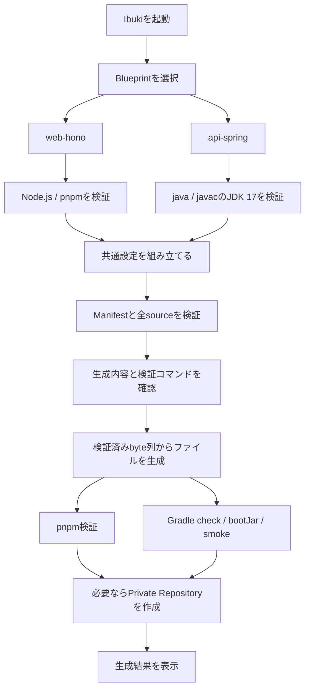

# v0.5 Spring Boot API Blueprint

## 目的

`api-spring`を2つ目の実働Blueprintとして追加し、BootstrapperのNode.js・pnpm固定処理を
BlueprintごとのToolchain・検証コマンドへ分離する。

Antigravity初版のReact、Hono、Spring Boot、Composeを独立したsystemとして扱う構想を
引き継ぐ。ただし初版にあった「全プロジェクトでpnpmを統一する」という記述より、
各Blueprint manifestのToolchain宣言を実行要件の正本とする。

## 決定事項

- Blueprint IDは`api-spring`
- Kotlin、Spring Boot 4.1.0、Gradle 9.5.1を固定
- Gradle projectとWrapperは`systems/api-server`内へ配置
- 実行環境は`java`と`javac`を備えたJDK 17に限定
- Java Toolchainも17へ固定し、自動ダウンロードに依存しない
- Node.jsとpnpmは`api-spring`の生成要件にしない
- DB、認証、OpenAPI、Dockerは対象外
- Manifest schema v2を使用し、Toolchain、検証コマンド、text／binaryを宣言
- Gradle Wrapper JARとGradle distributionのSHA-256を検証
- remote Blueprintは起動時に解決した単一Commitから取得
- 全sourceをbyte列で取得・検証してから生成先へ最初の書き込みを行う
- textはUTF-8 BOMなし・LF、binaryはbyte列を変更せず書き込む

## 生成フロー

## Spring Boot API

- 配置: `systems/api-server`
- port: `8080`
- health: `GET /internal/health`
- unknown path: RFC 9457互換のProblem Detailsを
  `application/problem+json`で返す
- test: application context、health、404
- artifact: executable jar
- smoke: 一時portでjarを起動し、healthと404を確認後、`finally`でprocessを終了

## 安全性

- source、target、検証作業directoryは生成rootから逸脱できない
- Windows予約名、ADS、絶対path、`..`、末尾dot・spaceを拒否
- binary templateを禁止し、SHA-256不一致なら生成先を作る前に停止
- local sourceのreparse point経由のroot逸脱を拒否
- 検証はshell文字列ではなくcommand・arguments配列で実行
- 生成先の既存ファイルは上書きしない

## 対象外

- PostgreSQL、Redis
- Docker、Compose
- 認証、認可
- OpenAPI生成
- Spring Data
- React + Hono + Spring Boot複合Blueprint
- Android、Windows Desktop Blueprint
