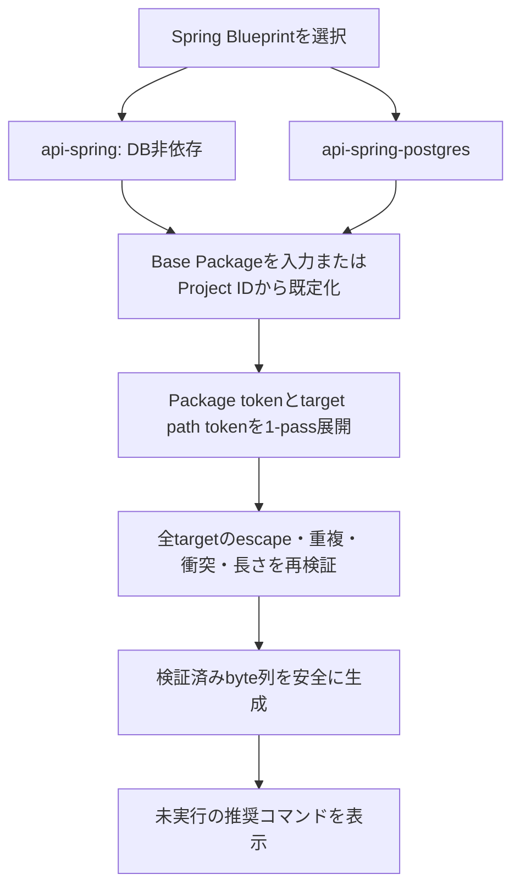

# v0.7 Spring Boot PostgreSQL Blueprint

## 目的

DB非依存の`api-spring`を維持しながら、PostgreSQL、MyBatis Dynamic SQL、
Flywayと明示実行のTestcontainers E2E基盤を持つ`api-spring-postgres`を追加する。
Ibukiは生成ファイルの安全性と再現性だけを検証し、生成先のGradle taskは実行しない。

## 生成フロー

## Base Package

- 明示入力は`-BasePackage`と対話入力で同じ検証を使用する。
- 未指定時はProject IDからハイフンを除去し、
  `net.rukaruka966.<normalized-project-id>`とする。
- 正規化した末尾segmentがJava／Kotlinの予約語またはWindows device名になる
  場合は`app`を付加する。たとえば`class`は`net.rukaruka966.classapp`、
  `co-n`は`net.rukaruka966.conapp`とする。
- Java／Kotlinの予約語、Windows device名、空segment、slash、backslash、
  path traversalを明示入力では拒否する。
- Package宣言には`__BASE_PACKAGE__`、target pathには
  `__BASE_PACKAGE_PATH__`を使用する。
- target tokenはManifest schema v4の`targetTemplate`で明示し、
  `__BASE_PACKAGE_PATH__`以外を許可しない。

## Databaseとテスト

- PostgreSQL接続は`DB_URL`、`DB_USERNAME`、`DB_PASSWORD`を参照する。
- Flywayは標準schemaと`classpath:db/migration`を使用する。
- 架空の業務Model、Mapper、Service、CRUD、Migration、fixtureは生成しない。
- `src/test`はDatabaseとDockerへ依存しないUnit Test専用とする。
- `e2eTest`は独立SourceSetとし、`check`へ接続しない。
- 初期状態の`e2eTest`はテスト未配置による`NO-SOURCE`であり、
  PostgreSQL接続を実証したことを意味しない。
- Docker DesktopのLinuxコンテナモードは生成要件ではなく、
  `e2eTest`を明示実行するときだけ必要とする。

## 生成先CI

GitHub Actions `Quality`はWindows上で`check`と`bootJar`だけを実行する。
PostgreSQL Service、Docker、`e2eTest`はCIの初期構成へ含めない。
