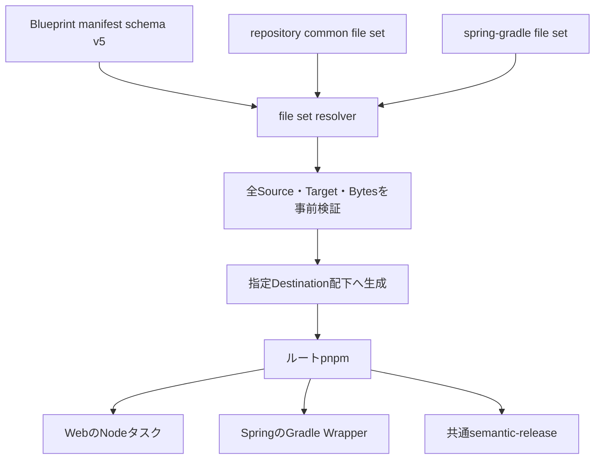

# v0.8 Blueprint共通Repository基盤

Issue: [#42](https://github.com/rukaruka966/ibuki-bootstrapper/issues/42)

## 目的

Ibuki初版の「pnpmをGradleを含む全プロジェクトの統一エントリーポイントにする」
思想を、現行の安全なファイル生成契約へ適合させて復元する。

## 生成構造

common assetはIbuki内で一元管理する。生成時は選択したBlueprint固有assetと
メモリ上で合成し、指定された1つのDestination配下へだけ出力する。



## Manifest schema v5

Blueprintは`fileSets`で共通asset群を参照する。

```json
{
  "schemaVersion": 5,
  "fileSets": ["repository"],
  "files": []
}
```

- file setの再帰参照は禁止する。
- commonとBlueprint固有filesの暗黙の上書きは禁止する。
- 大文字小文字を区別せずTarget重複とfile／directory衝突を検出する。
- local実行では各asset rootのreparse pointを拒否する。
- remote実行では全assetを同じimmutable Commitから取得する。
- 全Sourceの取得と検証が完了するまでDestinationへ書き込まない。

`projectRequirements`は`category`を必須とし、確認画面でも用途を分けて表示する。

- `repository`: 全Blueprint共通のRepository操作に使うNode.jsとpnpm
- `application`: Springアプリケーション固有のJDKと`javac`

## pnpm統一契約

すべての生成Repositoryがルートに`package.json`と`pnpm-lock.yaml`を持つ。
lockfileはRepository内に1つだけ生成する。

| Command | Web | Spring |
| --- | --- | --- |
| `pnpm dev` | Node workspaceを起動 | `bootRun`へ委譲 |
| `pnpm test` | Node workspaceのUnit Test | Gradle `test`へ委譲 |
| `pnpm check` | lint、test、typecheck、build | Gradle `check`とRelease Notes test |
| `pnpm build` | Node workspaceをbuild | Gradle `bootJar`へ委譲 |
| `pnpm release` | semantic-release | semantic-release |
| `pnpm e2e` | 未定義 | PostgreSQL構成だけ`e2eTest`へ委譲 |

Springの委譲runnerはOSを判定し、Windowsでは`gradlew.bat`、それ以外では
`gradlew`を使用する。Gradle WrapperはSpringのBuild Systemとして維持する。

## 共通Release

- semantic-release関連依存は完全固定する。
- `conventional-changelog-conventionalcommits`はwriter 8世代と互換性がある
  `9.3.1`を使用する。
- Release Notes testでFeaturesとBug Fixesの本文を確認する。
- `main`のQuality成功後だけReusable Release Workflowを呼び出す。
- Git TagとGitHub Releaseだけを作成し、CHANGELOG Commitは作らない。

## 初版から復元しないもの

- `npx`による未固定実行
- caret等による依存バージョン範囲指定
- CIの`|| true`
- Windows専用のインライン`powershell -Command`
- 現在存在しない構成向けのダミーscript

## Definition of Done

- すべてのBlueprintが`repository` file setを使用する。
- Spring Blueprintが`spring-gradle` file setを使用する。
- commonと固有Targetの衝突を生成前に拒否する。
- local／remote生成が同じpathとbytesを出力する。
- 全Blueprintがルートpnpmと単一lockfileを生成する。
- Ibukiは生成先のinstall、test、build、releaseを実行しない。
- `pnpm run verify`が成功する。
