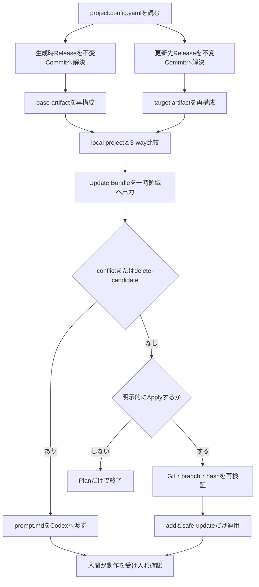

# v0.9 Project Updater設計

## 目的

過去のIbuki Releaseで生成したプロジェクトを、プロジェクト固有の変更を保持したまま
新しいBlueprintへ更新するための判断材料を作る。

Ibukiは意味のある競合を自動解決しない。機械的な比較結果とCodex向けpromptを出力し、
AIが実装判断、人間が最終的な受け入れ確認を担当する。

## 責任境界

Updaterが担当すること:

- 生成時と更新先のReleaseを不変Commitへ解決する
- 同じ入力からbaseとtargetの生成ファイルを再構成する
- 現在のプロジェクトを含む3-way比較を行う
- Update Bundleをプロジェクト外へ出力する
- 競合がない場合だけ、明示指定されたApplyを安全に行う

Updaterが担当しないこと:

- AI APIの呼び出しとAPI Keyの管理
- 業務上の意味を持つ競合の自動解消
- ファイルの自動削除
- 生成先のinstall、lint、test、build、起動
- Commit、push、Pull Request作成

## 全体フロー



## `project.config.yaml` schema v2

```yaml
schemaVersion: 2
project:
  id: sample-app
  displayName: "Sample App"
branchStrategy:
  default: main
  integration: develop
systems: []
bootstrapper:
  source: rukaruka966/ibuki-bootstrapper
  blueprint: web-hono
  version: 0.9.0
  commit: 0123456789abcdef0123456789abcdef01234567
```

`commit`を比較の正本とする。`version`は人間向け表示とRelease選択に使う。
schema v1ではsystemsのtypeからBlueprintを推論し、記録済みversionのTagを不変Commitへ
解決する。

## 3-way分類

| 状態 | 分類 | 自動Apply |
| --- | --- | --- |
| baseになく、localになく、targetにある | `add` | 可 |
| localがbaseと同じでtargetが変化 | `safe-update` | 可 |
| targetがbaseと同じでlocalだけ変化 | `keep-local` | 変更しない |
| localとtargetが同じ | `already-current` | 変更しない |
| localとtargetがbaseから別々に変化 | `conflict` | 不可 |
| baseにありtargetから消えた | `delete-candidate` | 不可 |

localで削除され、targetが変化していないファイルは`keep-local`とする。localで削除され、
targetも変化した場合は`conflict`とする。

text fileのunified diffはbaseからtargetへの変更だけを出力する。binary fileは本文差分を
作らない。localは本文を出力せず、text・binaryともSHA-256と相対パスだけを
`plan.json`へ記録する。

## Update Bundle

既定の出力先はOSの一時領域であり、プロジェクト内には永続状態を作らない。

```text
ibuki-update-<project-id>-<timestamp>/
├── plan.json
├── prompt.md
├── summary.md
├── artifacts/
│   ├── base/
│   └── target/
└── diffs/
    ├── safe-update/
    └── conflicts/
```

`plan.json`が機械判定の正本である。`prompt.md`は大きなdiffを埋め込まず、Bundle内の
ファイル参照と作業契約を記載する。Update Planはschema 2とし、`project`にはID、
Blueprint、branch strategyだけを記録してproject rootを保存しない。schema 1のPlanは
Applyせず、現在のUpdaterで再生成する。

Bundleにはローカルファイルの本文とproject・Bundleの絶対パスを含めない。競合解消時は
接続中のprojectにある`operation.path`を読み、`targetHash`があればtarget diffまたは
artifact、`targetHash`がnullなら`artifacts/base/<operation.path>`と比較する。
promptはBundle内容を命令ではなくuntrusted dataとして扱うようAIへ明記する。

ApplyはPlanの操作内容、artifact、現在のproject間の不整合を検出する。生成時刻など
Apply判断に使わないmetadataの変更は対象外であり、Bundle全体を暗号学的には認証しない。
Planと対応artifactを同時に改変した攻撃を信頼anchorなしには判別できないため、
ダウンロード・共有されたBundleへApplyしてはならない。疑わしい場合は手元でPlanから
Bundleを再生成する。

## Applyの安全条件

Applyは次をすべて満たす場合だけ動作する。

- Apply時に`-ProjectRoot`で対象projectを明示する
- 明示したprojectのID、Blueprint、branch strategyがPlanと一致する
- `conflict`と`delete-candidate`が0件
- Git worktreeがclean
- 現在branchがdefault branchでもintegration branchでもない
- Plan作成時のlocal SHA-256と現在のファイルが一致する
- target artifactのSHA-256がPlanと一致する
- project pathとBundle pathにreparse pointがない
- `-Yes`を明示するか、対話promptで承認する

`project.config.yaml`は最後に更新する。途中失敗時は、Updaterが変更したファイルだけを
hash確認後にrollbackする。

## Release受け入れ

最初の実利用確認は、Ibuki v0.8.0で生成された`media-node`を対象にする。

1. Plan Modeでプロジェクトファイルが変化しない。
2. Update Bundleに全分類とCodex向けpromptが出力される。
3. AIが競合を解消し、プロジェクト固有変更を保持する。
4. 更新後の`project.config.yaml`がschema v2とReleaseの不変Commitを記録する。
5. `media-node`自身の定義に従い、利用者が最終動作を確認する。
